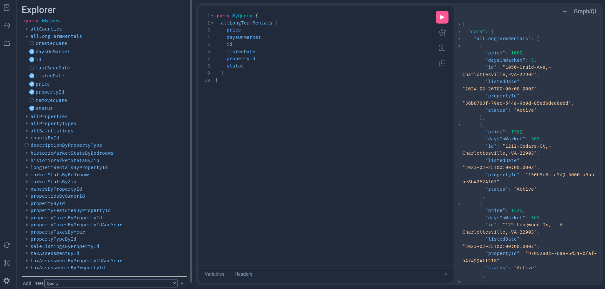

# RentRadar

RentRadar is a comprehensive data platform for real estate market analysis, offering an array of modules for data ingestion, database management, and API access to real estate data.

## Setup

Follow the guide below to setup your development environment.

### Prerequisites

Before setting up the project, ensure you have Poetry installed. If you do not have Poetry installed, follow the installation instructions on the [official Poetry website](https://python-poetry.org/docs/#installation).

### Development Environment

1. **Clone the Repository**

    First, clone the project repository to your local machine using Git:

    ```bash
    git clone https://github.com/twt6xy/RentRadar.git
    cd RentRadar
    ```

2. **Install Dependencies**
    With Poetry installed, run the following command in the project root directory to install both production and development dependencies. This command reads the `pyproject.toml` file and installs the dependencies specified there, honoring the versions specified in the `poetry.lock` file:

    ```bash
    poetry install
    ```

3. **Activating the Environment**

    Poetry creates a virtual environment for your project to manage dependencies separately from your global Python installation. To activate this environment, use the command:

    ```bash
    poetry shell
    ```

4. **Setting Up Pre-commit Hooks**

    To ensure code quality and consistency, this project uses pre-commit hooks with tools like `black`, `isort`, `ruff`, and `pytest` for automatic code formatting and quality checks. First, install the pre-commit hooks defined in the `.pre-commit-config.yaml` file by running the following command within the project's root directory:

    ```bash
    poetry run pre-commit install
    ```

    Here's what each hook does:

    - **`black`**: This hook automatically formats Python code to adhere to a consistent style, making it readable and maintainable according to the Black code style guide.

    - **`isort`**: This hook ensures that all Python import statements follow a consistent format by sorting imports alphabetically and automatically separates them into sections.

    - **`ruff`**: Provides fast linting for Python code, catching syntax errors and stylistic issues based on common Python coding standards. Unlike `black`, which formats code, `ruff` focuses on identifying and reporting issues without automatically fixing them.

    - **`pytest`**: Runs your project's test suite with Pytest, ensuring that all tests pass before a commit is finalized. This hook helps catch and prevent errors in code functionality. Any files prefixed with `test_`, and any functions within those files prefixed with `test_` in the `tests` directory will be run.

    <br>
    After installing the hooks, they will run automatically on files staged for commit. If any hook reports errors, the commit will be blocked until the issues are resolved. Run the following command to verify the hooks have been installed correctly.

    ```bash
    poetry run pre-commit run
    ```

### Environment Variables

This project requires certain environment variables to be set for its proper operation. Specifically, you will need an API access key from RentCast to access rental market data.

1. Visit [RentCast](https://www.rentcast.io/) and sign up for an account or log in if you already have one.
2. Navigate to the API section and follow the instructions to obtain your API access key.
3. In the root directory, create a file named `.env`.
4. Open the `.env` file in a text editor and add the following line:

    ```
    RENTCAST_API_KEY=<your_api_key>
    ```

   Replace `your_api_key` with the actual API key you obtained from RentCast.

## RentRadar Modules

RentRadar employs a modular architecture to streamline real estate data analysis, consisting of `ingest`, `db`, and `api` modules. Each module serves a specific purpose within the data pipeline, from data collection to database management and API access, adhering to the principle of separation of concerns.

### Ingest

The `ingest` module, powered by the `RentCastAPIClient`, automates the collection of raw data from various [RentCast](https://www.rentcast.io/) endpoints, including:

- `/properties`: Fetches detailed property data.
- `/listings/sale`: Retrieves listings available for sale.
- `/listings/rental/long-term`: Gathers long-term rental listings.
- `/markets`: Provides market statistics for different regions.

Data fetched from these endpoints is cached as local CSV files to be processed before loading them into the [DuckDB](https://duckdb.org/) database.

### DB

The `db` module features the `DuckDBManager`, a context manager designed for creating, connecting to, and interacting with [DuckDB](https://duckdb.org/) databases. It ensures safe and automatic closure of database connections. Stored data is persisted on disk at `db/rentradar.db`.

The `RentRadarQueryAgent`, a subclass of `DuckDBManager`, offers a tailored interface for interacting with RentRadar-specific data. This arrangement adheres to the principle of separation of concerns, maintaining `DuckDBManager` as a generic interface for any DuckDB database while the `RentRadarQueryAgent` provides specialized queries and operations specific to RentRadar's data model.

### API

The `api` module utilizes [Strawberry](https://strawberry.rocks/docs) to define a GraphQL schema (`api/schema.py`), encapsulating the RentRadar data model. The GraphQL API layer (`api/graphql.py`) leverages the `RentRadarQueryAgent` to provide data access. The main API functionality is housed in `api/deploy.py`, deploying a GraphQL server that exposes the RentRadar data on `localhost` (for now).

This modular architecture ensures RentRadar is not only a powerful tool for real estate market analysis but also a flexible and expandable platform, ready to accommodate future data sources and functionalities.

## Getting Started

To get started with RentRadar, follow these steps to set up your development environment. After completing the setup, you can easily deploy the GraphQL server and access the RentRadar API.

1. **Environment Setup**: Ensure you have followed the setup instructions detailed in the setup section. This includes installing dependencies via Poetry, and setting up the environment.

2. **Launch the GraphQL Server**:
   - From the project root, run the following command to start the GraphQL server with `uvicorn`:
     ```sh
     uvicorn rentradar.api.deploy:app --reload
     ```
   - This command starts the server in development mode with hot reload enabled, allowing you to see changes in real-time without restarting the server manually.

3. **Accessing the GraphQL API**:
   - Once the server is running, you can access the GraphQL API interface by navigating to [http://127.0.0.1:8000/](http://127.0.0.1:8000/) in your web browser.
   - The GraphQL interface provides a playground where you can experiment with queries and mutations, explore the schema, and interact with your RentRadar data.

By following these steps, you'll have a local instance of the RentRadar GraphQL server running, ready for you to explore and utilize the real estate data it provides access to.

### GraphQL Server Interface

Here's what the GraphQL server interface looks like when accessed through your browser:



## Contributing

Before making your changes, please create a feature branch off the main branch. This isolates your changes and makes it easier to review and merge them into the main project. Here's how you can create and switch to a feature branch:

1. Ensure you're on the main branch and your local repository is up to date:

    ```bash
    git checkout main
    git pull origin main
    ```
2. Create a new branch named after the feature you're working on:

    ```bash
    git checkout -b feature/<your_feature_name>
    ```

3. With your feature branch checked out, you can make your changes to the project. After making changes, stage and commit them:

    ```bash
    git add .
    git commit -m "<Describe your changes here>"
    ```

    This will trigger the pre-commit hooks, if any hooks fail:

    - You will need to resolve the failures as indicated by the hook's output.
    - Even for hooks that automatically fix issues (e.g., `trailing-whitespace`, `end-of-file-fixer`), you must stage the auto-corrected files again since the hooks modify the files after staging.

4. Once your changes are ready and all pre-commit hooks pass, push your feature branch to the remote repository:

    ```bash
    git push origin feature/<your_feature_name>
    ```
5. Go to the project's GitHub page. You should see an option to "Compare & pull request" for your newly pushed branch. Click it to open a new pull request (PR).

6. Fill in the PR form with a clear title and description of your changes. Explain the purpose of your changes and any other relevant information that would help the reviewers.

7. Submit the pull request. Your PR will be reviewed by the project maintainers.

8. Once your pull request has been approved and merged into the main branch, you can pull the changes to your local main branch.

    ```bash
    git checkout main
    git pull origin main
    ```

9. Delete your feature branch if it's no longer needed, both locally and on the remote repository:

    - Delete the branch locally:
      ```bash
      git branch -d feature/<your_feature_name>
      ```

    - Delete the branch from the remote repository:
      ```bash
      git push origin --delete feature/<your_feature_name>
      ```
